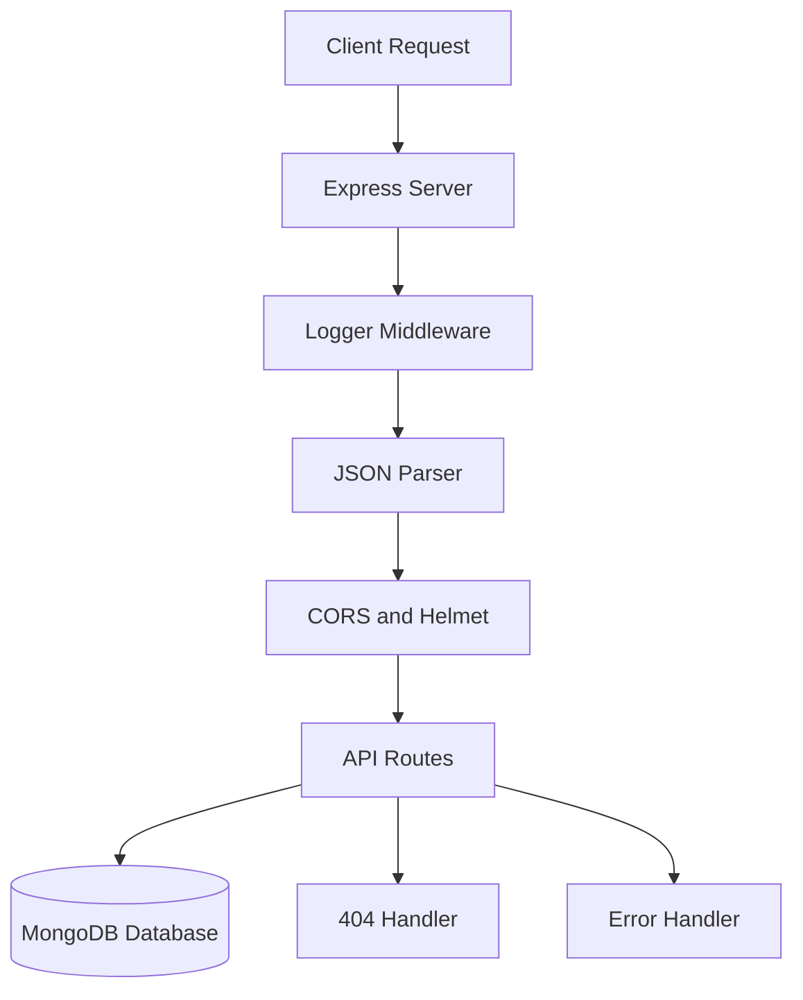

# Blendet Products API

A Node.js and Express backend project for building a product management API with MongoDB.

## Overview

Blendet Products is a backend application created as a practical Express.js project.
The project provides a ready backend structure with server setup, MongoDB connection, request logging, security middleware, and centralized error handling.

The goal of this project is to practice building a clean REST API architecture for working with product data.

## Current Features

- Express server setup
- MongoDB connection with Mongoose
- Environment variable support with dotenv
- Request logging with pino-http and pino-pretty
- Security headers with helmet
- CORS support
- JSON request body parsing
- 404 route handler
- Centralized error handler
- Development mode with nodemon

## Project Structure

```txt
blendet-products/
├── src/
│   ├── db/
│   │   └── connectMongoDB.js
│   ├── middlewares/
│   │   ├── errorHandler.js
│   │   ├── logger.js
│   │   └── notFoundHandler.js
│   └── server.js
├── package.json
├── package-lock.json
├── eslint.config.js
├── .editorconfig
├── .prettierrc
└── README.md
```

## How it works



The server receives HTTP requests, applies middleware, connects to MongoDB, and returns JSON responses.

## Tech Stack

### Backend

- Node.js
- Express
- MongoDB
- Mongoose
- dotenv
- cors
- helmet
- pino-http
- pino-pretty
- nodemon

### Development Tools

- ESLint
- Prettier
- EditorConfig

## Getting Started

### 1. Clone the repository

```bash
git clone https://github.com/Larimar4you/blendet-products.git
cd blendet-products
```

### 2. Install dependencies

```bash
npm install
```

### 3. Create an environment file

Create a `.env` file in the project root:

```env
MONGO_URL=your_mongodb_connection_string
```

### 4. Run the project in development mode

```bash
npm run dev
```

The server will start on:

```txt
http://localhost:3000
```

## Available Scripts

```bash
npm run dev
```

Runs the server with nodemon for development.

```bash
npm start
```

Runs the server with Node.js.

## Environment Variables

| Variable    | Description               |
| ----------- | ------------------------- |
| `MONGO_URL` | MongoDB connection string |

## API Status

The basic server infrastructure is implemented.
Product routes, controllers, models, and validation can be added as the next development step.

## Planned Features

- Product model
- Product routes
- Get all products
- Get product by ID
- Create product
- Update product
- Delete product
- Request validation
- Pagination
- Filtering
- Sorting
- Error handling for invalid IDs

## Example Future Routes

```txt
GET    /products
GET    /products/:productId
POST   /products
PATCH  /products/:productId
DELETE /products/:productId
```

## Author

Created by Lara Kosta as part of backend development practice.
